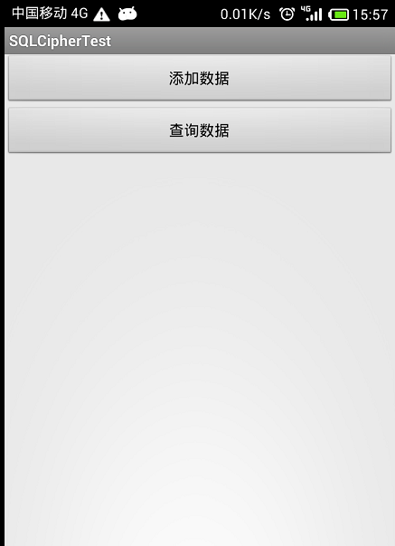

SQLCipherTest
====================================================
本类继承自net.sqlcipher.database.SQLiteOpenHelper,用于对创建的数据库进行加密解密处理，防止数据库中的数据在ROOT过的设备上进行泄露。
##eclipse下

项目使用时，请将libs下的包和asserts目录下的zip复制到自己项目中。本类初始化先调用SQLiteDatabase.loadLibs(this);加载JNI本地库，然后调用构造器DBHelperUtil.DBHelperUtil(Context, String, CursorFactory, int)便可以获取到数据库的对象，本类中提供了常用的数据库操作方法。

##Android Studio下

__[Android Studio中使用请查看官网：https://www.zetetic.net/sqlcipher/sqlcipher-for-android/](https://www.zetetic.net/sqlcipher/sqlcipher-for-android/)__
#####博客参考 __[http://www.2cto.com/kf/201508/438544.html](http://www.2cto.com/kf/201508/438544.html)__
###参考资料
__[http://blog.csdn.net/sziicool/article/details/18728153](http://blog.csdn.net/sziicool/article/details/18728153)__

###效果图
--------------------------------------------------------------------------------------------
